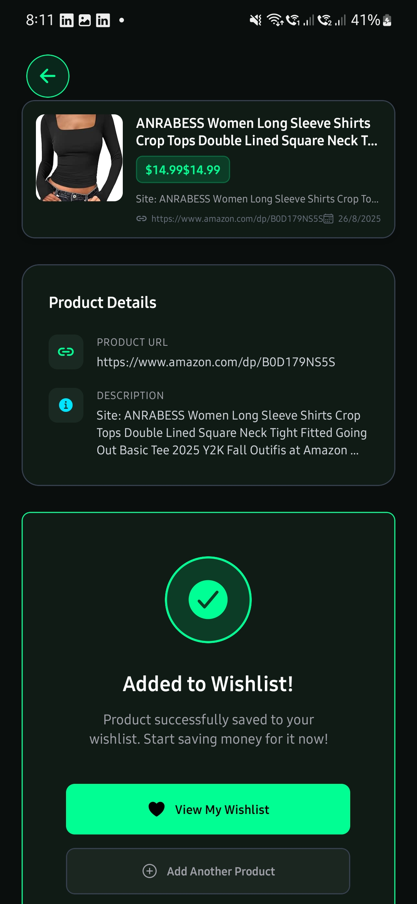
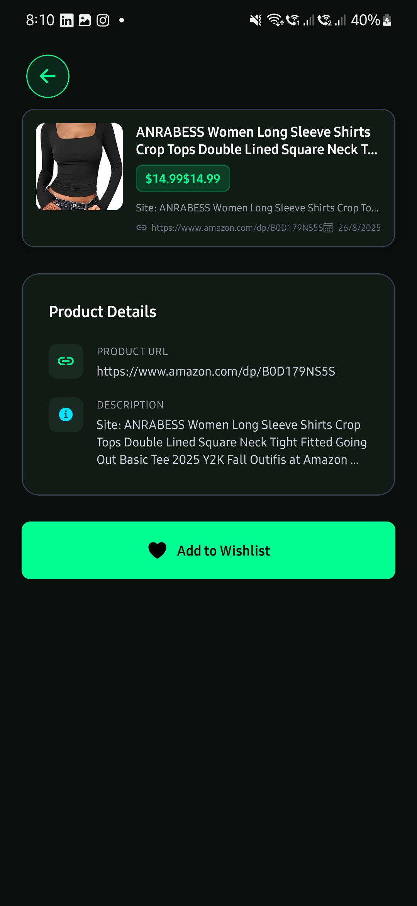
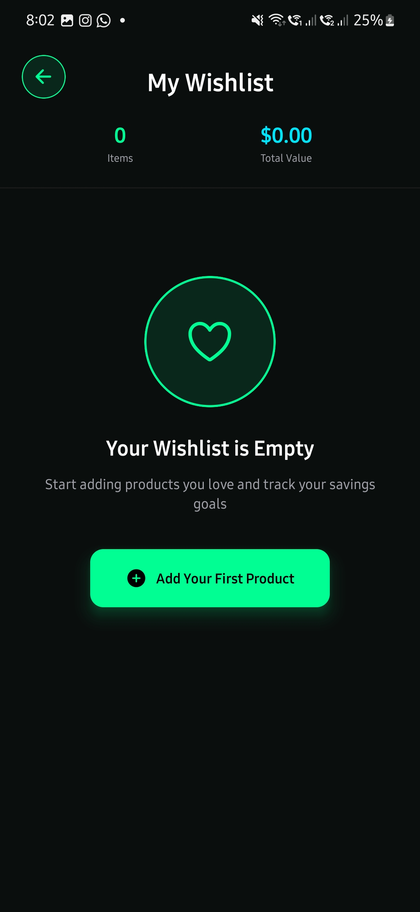
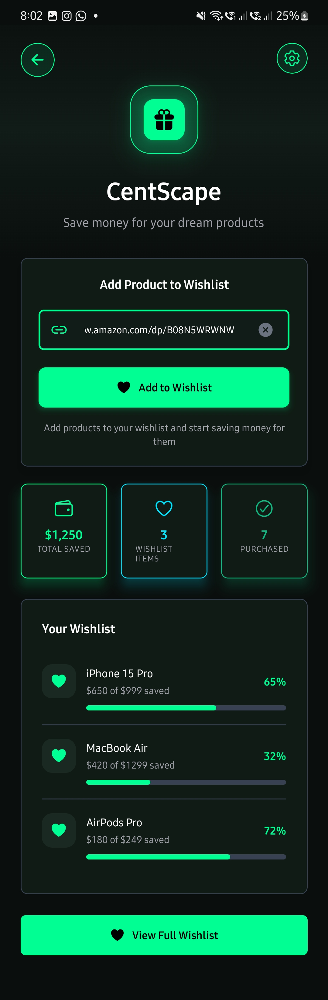
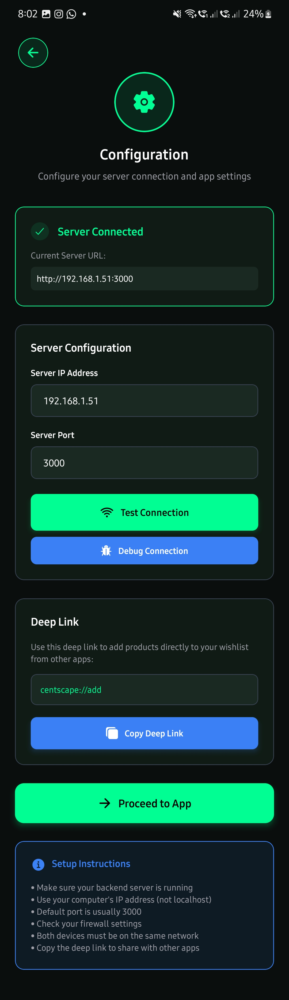

# Centscape - Smart Wishlist Management

A React Native mobile application with Node.js backend for intelligent product wishlist management with deep linking capabilities.

## Table of Contents

- [Project Overview](#project-overview)
- [Screenshots](#screenshots)
- [Architecture](#architecture)
- [Tech Stack](#tech-stack)
- [Engineering Trade-offs](#engineering-trade-offs)
- [Project Structure](#project-structure)
- [Quick Start](#quick-start)
- [Configuration](#configuration)
- [Deep Linking](#deep-linking)
- [Development](#development)
- [AI Assistance Disclosure](#ai-assistance-disclosure)

## Project Overview

Centscape is a mobile application that allows users to:
- **Add products** to wishlist via deep links
- **Extract product metadata** (title, price, images) from URLs
- **Manage wishlist** with local storage
- **Configure server settings** for backend connectivity
- **Cross-platform support** (Android/iOS)

## Screenshots

### Configuration Screen

*Server configuration and connection testing interface*

### Add URL Screen

*Main home screen for entering product URLs*

### Product Preview

*Product metadata extraction and preview*

### Wishlist Management

*Wishlist items with product information*

### Success Message

*Confirmation when product is added to wishlist*

### Deep Link Testing

*Testing deep link functionality in browser*

### Backend Console

*Server console showing available IP addresses and endpoints*

## Architecture

```
┌─────────────────┐    ┌─────────────────┐    ┌─────────────────┐
│   Mobile App    │    │   Backend API   │    │  Product URLs   │
│  (React Native) │◄──►│   (Node.js)     │◄──►│  (Amazon, etc.) │
└─────────────────┘    └─────────────────┘    └─────────────────┘
         │                       │
         │                       │
    ┌─────────┐            ┌─────────┐
    │ Local   │            │ Metadata│
    │Storage  │            │Extractor│
    └─────────┘            └─────────┘
```

## Tech Stack

### Frontend (Mobile App)
- **React Native** with Expo
- **TypeScript** for type safety
- **Expo Router** for navigation
- **AsyncStorage** for local data persistence
- **Axios** for HTTP requests

### Backend (API Server)
- **Node.js** with Express.js
- **TypeScript** for type safety
- **Cheerio** for HTML parsing
- **Axios** for HTTP requests
- **Helmet** for security headers
- **CORS** for cross-origin requests
- **Rate Limiting** for API protection

### Development Tools
- **Expo CLI** for development
- **Metro** bundler
- **ESLint** for code quality
- **TypeScript** compiler

## Engineering Trade-offs

### **Chosen Technologies & Rationale**

#### **React Native + Expo**
**Pros:**
- **Cross-platform development** - Single codebase for iOS/Android
- **Rapid development** - Hot reload, over-the-air updates
- **Rich ecosystem** - Extensive library support
- **TypeScript support** - Better developer experience

**Trade-offs:**
- **Performance overhead** - Bridge between JS and native code
- **Bundle size** - Larger app size compared to native
- **Platform limitations** - Some native features require custom modules

#### **Node.js + Express Backend**
**Pros:**
- **JavaScript ecosystem** - Shared language with frontend
- **Rapid API development** - Express.js simplicity
- **Rich middleware ecosystem** - Security, validation, etc.
- **Easy deployment** - Cloud platform support

**Trade-offs:**
- **Single-threaded** - CPU-intensive tasks can block
- **Memory usage** - Higher compared to compiled languages
- **Error handling** - Asynchronous nature complexity

#### **Local Storage (AsyncStorage)**
**Pros:**
- **Offline functionality** - Works without internet
- **Fast access** - No network latency
- **Simple implementation** - No database setup required

**Trade-offs:**
- **Data persistence** - Lost on app uninstall
- **No sync** - Data doesn't sync across devices
- **Storage limits** - Limited by device storage

#### **Deep Linking**
**Pros:**
- **Seamless UX** - Direct product addition
- **Platform integration** - Works with external apps
- **Marketing potential** - Shareable links

**Trade-offs:**
- **Platform complexity** - Different implementations per OS
- **URL validation** - Security considerations
- **Testing complexity** - Requires device testing

### **Risk Assessment**

#### **High Risk Areas**
1. **URL Parsing Reliability** - Different websites have varying HTML structures
2. **Rate Limiting** - Some sites may block automated requests
3. **Deep Link Compatibility** - Platform-specific implementations
4. **Data Loss** - Local storage can be cleared by users

#### **Mitigation Strategies**
1. **Robust Error Handling** - Graceful degradation for parsing failures
2. **Request Throttling** - Respectful crawling with delays
3. **Fallback Mechanisms** - Alternative parsing strategies
4. **Data Export** - Backup functionality for user data

## Project Structure

```
centscape/
├── frontend/                 # React Native mobile app
│   ├── app/                 # Expo Router screens
│   │   ├── _layout.tsx      # Root navigation layout
│   │   ├── index.tsx        # Entry point (redirects to config)
│   │   ├── config.tsx       # Server configuration screen
│   │   ├── addURL.tsx       # Main home screen
│   │   ├── addProduct.tsx   # Product preview & add to wishlist
│   │   └── wishlist.tsx     # Wishlist management
│   ├── components/          # Reusable UI components
│   │   ├── UrlPreviewCard.tsx
│   │   ├── LoadingSpinner.tsx
│   │   └── common/          # Basic UI components
│   ├── services/            # API and configuration services
│   │   ├── apiClient.ts     # HTTP client configuration
│   │   ├── configService.ts # Server config management
│   │   └── previewService.ts # URL preview service
│   ├── hooks/               # Custom React hooks
│   │   ├── useUrlPreview.ts # URL preview hook
│   │   └── useWishlist.ts   # Wishlist management hook
│   ├── types/               # TypeScript type definitions
│   ├── utils/               # Utility functions
│   └── constants/           # App constants
├── backend/                 # Node.js API server
│   ├── src/
│   │   ├── index.ts         # Main server file
│   │   └── services/        # Business logic services
│   │       ├── MetadataExtractor.ts
│   │       └── UrlNormalizer.ts
│   └── public/              # Static files
├── start-android.bat        # Windows Android launcher
├── start-android.ps1        # PowerShell Android launcher
├── start-android.sh         # Mac/Linux Android launcher
├── start-web.bat            # Windows web launcher
├── start-web.ps1            # PowerShell web launcher
└── README.md               # This file
```

## Quick Start

### Prerequisites
- **Node.js** (v16 or higher)
- **npm** or **yarn**
- **Expo Go** app on your mobile device
- **Android Studio** (for emulator testing)

### 1. Clone and Install
```bash
git clone <repository-url>
cd centscape
npm install
cd frontend && npm install
cd ../backend && npm install
```

### 2. Start Backend Server
```bash
# Windows
start-backend.bat

# Mac/Linux
cd backend && npm start

# Or manually
cd backend
npm install
npm start
```

### 3. Start Mobile App
```bash
# Windows
start-android.bat

# Mac/Linux
./run-android.sh

# Or manually
cd frontend
npx expo start
```

## Configuration

### Server Configuration
1. **Start the backend server** - It will display available IP addresses
2. **Open the mobile app** - Navigate to Config screen
3. **Enter server details**:
   - **IP Address**: Use the network IP shown in backend console
   - **Port**: Default is 3000
4. **Test connection** - Verify backend connectivity
5. **Copy deep link** - Use for testing deep link functionality

### Backend Console Output
When you start the backend server, you'll see:
```
Centscape Backend Server v1.0.0
Environment: development
Debug mode: true
Server running on port 3000
Available URLs:
   • Localhost: http://localhost:3000
   • Network: http://192.168.1.100:3000  ← Use this IP
Health check: http://localhost:3000/health
Version info: http://localhost:3000/version
Server info: http://localhost:3000/server-info
Metadata extraction: http://localhost:3000/extract-metadata
```

## Deep Linking

### Deep Link Format
```
centscape://add?url=YOUR_PRODUCT_URL
```

### Testing Deep Links
1. **Browser Test**: Open Chrome/Firefox on Android device
2. **Enter URL**: `centscape://add?url=https://www.amazon.com/dp/B08N5WRWNW`
3. **Press Enter**: Should open app and navigate to product screen

### Supported URLs
- **Amazon**: Product pages with ASIN
- **Other e-commerce**: General product pages
- **Any URL**: Will attempt metadata extraction

## Development

### Available Scripts

#### Frontend (React Native)
```bash
cd frontend
npm start          # Start Expo development server
npm run android    # Run on Android emulator
npm run ios        # Run on iOS simulator
npm run web        # Run in web browser
```

#### Backend (Node.js)
```bash
cd backend
npm start          # Start development server
npm run build      # Build TypeScript
npm run dev        # Start with nodemon
```

### Development Workflow
1. **Backend First**: Start backend server to get IP address
2. **Configure App**: Set server IP in mobile app config
3. **Test Deep Links**: Use browser or external apps
4. **Monitor Logs**: Check console for debugging info

### Debugging
- **Frontend**: Use Expo DevTools and React Native Debugger
- **Backend**: Check console logs for request/response details
- **Network**: Use browser dev tools for API testing

## AI Assistance Disclosure

**Important**: This project was developed with significant assistance from **Claude AI** (Anthropic's AI coding assistant). 

### AI Contributions
- **Code Generation**: Initial project structure and boilerplate code
- **Problem Solving**: Debugging and fixing technical issues
- **Architecture Design**: Tech stack recommendations and trade-off analysis
- **Documentation**: README creation and code comments
- **Testing**: Deep link testing strategies and debugging

### Human Oversight
- **Code Review**: All AI-generated code was reviewed and modified
- **Architecture Decisions**: Final tech stack choices made by developer
- **Business Logic**: Core application logic and requirements defined by developer
- **Quality Assurance**: Testing and validation performed by developer

### Development Process
1. **Requirements Gathering**: Human-defined project requirements
2. **AI-Assisted Development**: Claude helped with implementation
3. **Code Review**: Human developer reviewed and refined all code
4. **Testing**: Manual testing and validation by developer
5. **Documentation**: AI-assisted documentation with human oversight

This disclosure is provided for transparency and to acknowledge the collaborative nature of modern software development with AI tools.

---

## License

This project is licensed under the MIT License - see the LICENSE file for details.

## Contributing

1. Fork the repository
2. Create a feature branch
3. Make your changes
4. Test thoroughly
5. Submit a pull request

## Support

For support and questions:
- Create an issue in the repository
- Check the documentation
- Review the code comments

---

**Built with React Native, Node.js, and Claude AI assistance**
